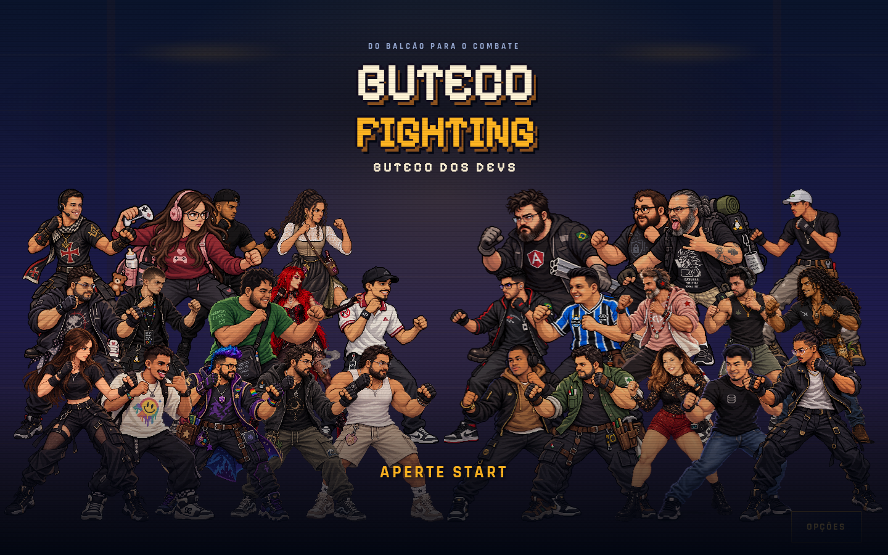
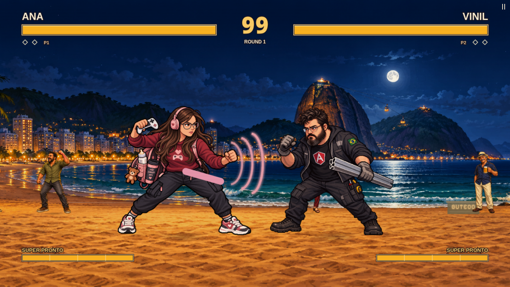

<div align="center">

# 🍻 Buteco Fighting

**Do balcão para o combate.**

A Brazilian browser fighting game. Pick your regular. Settle it in the arena.


[Play locally](#get-in-the-ring) · [Controls](#controls) · [Meet the roster](#the-regulars) · [Development](#under-the-hood)



</div>

## One keyboard. Two rivals. No installation for players.

Buteco Fighting brings an arcade cabinet to the browser: a full cast of original characters, Brazilian city stages, animated crowds and a warm amber-and-midnight interface. The menus are in Portuguese. The rivalry needs no translation.

| Mode | Your night at the Buteco |
| --- | --- |
| **Arcade** | Take on the CPU through a three-fight campaign. Choose your difficulty and win the best of three rounds. |
| **Versus** | Two players share a keyboard. Pick both fighters and settle the score locally. |
| **Training** | Practice movement, combos and powers with replenishing energy. |

**The fight:** directional jumps, air and crouching attacks, uppercuts, sweeps, dashes, blocking, hitstop and knockdowns. Each fighter has a special and a super, with powers ranging from sonic waves and returning tools to digital cubes, holograms and lunar mist.

**The cabinet:** live character previews, alternating special/super demonstrations on a Cartesian training grid, full-screen menus, sound settings and touch controls. The browser loads combat animations for the selected pair on demand.



## Get in the ring

You need a recent Node.js installation, npm and a modern browser.

```sh
git clone git@github.com:brunofunnie/buteco-fighting.git
cd buteco-fighting
npm ci
npm start
```

Open **[localhost:3187](http://localhost:3187)**. No build step or API key is needed to play: the published sprites, arenas and audio ship with the repository.

To use another port:

```sh
PORT=3188 npm start
```

## Docker deployment

The supplied Compose stack serves the game on **container port 80** and joins the external `bender-network` used by the Cloudflare tunnel. Both the Compose project and container are named `buteco-fighting`.

```sh
docker compose up -d --build
docker compose ps
```

The tunnel origin is `http://buteco-fighting:80`. No host port is published; the tunnel reaches the container through the shared Docker network. The image bundles production dependencies and playable assets, runs as the Node user and includes an HTTP health check.

### Git deployment in Dockhand

On Bender, use a **Git stack** named **buteco-fighting** in environment **Bender**, tracking `main` from `git@github.com:brunofunnie/buteco-fighting.git`, with compose path **compose.git.yaml**. Keep **Build images on deploy** disabled: this stack runs the checked-out code in the standard `node:24-alpine` image without building a custom image.

Dockhand copies the repository into its managed stack directory before deployment. The container mounts that directory read-only from the existing `dockhand_data` volume, copies the small application files into a writable runtime volume, links the playable assets from the checkout, installs locked production dependencies, and starts the HTTP server as the Node user. The tunnel origin remains `http://buteco-fighting:80`; no host port is published. Updates require pushing to `main` and clicking **Deploy** on this Git stack in Dockhand.

The compose file defaults to the volume `dockhand_data` and subdirectory `stacks/Bender/buteco-fighting`. For a different Dockhand installation, set `DOCKHAND_DATA_VOLUME` and `DOCKHAND_STACK_SUBPATH` in the Git stack's environment overrides. The subdirectory must match Dockhand's managed stack directory. Docker must support volume subpaths (Engine 26 or newer). The original `compose.yaml` and Dockerfile remain available for standalone image-based deployments.

## Controls

Keyboard bindings for each player can be changed in **OPÇÕES** and are saved under `buteco-controls-v1` in localStorage. Click a key, press its replacement, or choose **RESTAURAR TECLAS**. Escape cancels remapping and remains the pause/back shortcut. Two standard Xbox/PlayStation controllers are supported; connect them and press a button to activate. The first controller is P1 and the second is P2 in local versus. The in-game options screen includes the controller mapping.

| Action | Player 1 | Player 2 |
| --- | --- | --- |
| Move | A / D | ← / → |
| Jump / crouch | W / S | ↑ / ↓ |
| Punch / kick | J / K | 1 / 2 |
| Block | L | 3 |
| Special · **25 energy** | U | 4 |
| Super · **100 energy** | I | 5 |
| Directional jump | W + A / D | ↑ + ← / → |
| Air punch / kick | W + J / K | ↑ + 1 / 2 |
| Low punch / kick | S + J / K | ↓ + 1 / 2 |
| Uppercut / sweep | S + U / I | ↓ + 4 / 5 |
| Low block | S + L | ↓ + 3 |
| Dash | A,A / D,D | ←,← / →,→ |
| Pause | Esc | Esc |

Player 2 can also use the numeric keypad. Hold block to defend; touch devices display movement and attack buttons.

**Menus:** WASD or arrow keys navigate; Enter / J / 1 confirm; Esc / K / 2 go back. **Q** switches between player and rival during character selection. Sound preferences persist in your browser.

## Versus online

Choose **VERSUS ONLINE**, enter a nickname, and create a room or join by invitation/code. Open rooms are listed in the lobby. Each player chooses a fighter and confirms readiness; the host selects the arena and starts the best-of-three match. The host can expel a challenger before the match, which also blocks that browser identity from rejoining that room. A full or active room cannot accept another player.

Colyseus 0.18 runs on the same HTTP/WebSocket endpoint as the game. The server runs the shared combat simulation at 120 Hz and sends snapshots at 30 Hz. Clients send controls only; damage and results are server-authoritative. In an online match each player uses their own Player 1 keyboard/gamepad/touch mapping, including the challenger in the P2 seat. Opening the pause/options menu stops your input while the online match continues.

The leaderboard stores wins, perfect wins and losses in SQLite. A win is a completed best-of-three match; a perfect win means the winner took no damage throughout the match. Disconnecting during a live fight forfeits the match without perfect credit. Lobby departures and expulsions award no points. The guest identity is a browser-local token, not an account with cross-device login; clearing localStorage creates a new identity. Nicknames may be shared; server identities stay separate.

Set `RANKING_DB` to the SQLite file path. Both Compose configurations mount `online-data:/data`, so identity and ranking data survive deploys and restarts. Back up this volume and do not remove it when redeploying. Local development defaults to the ignored `data/rankings.sqlite`.

Open Graph and Twitter cards use the generated cover at `assets/social/buteco-fighting-og.png` (1200×630) and the canonical address `https://fighting.butecodosdevs.com/`.

## The regulars

**28 fighters. Every one has something to prove.**

<details>
<summary><strong>See every fighter, special and super</strong></summary>

| Fighter | Special | Super |
| --- | --- | --- |
| Rina Sabre | Corte de energia | Rajada Sabre |
| Waggy | Impacto urbano | Onda de impacto |
| ViiHuugo | Pulso prismático | Explosão arco-íris |
| Joke L | Bloco de dados | Overflow |
| King Luiz | Runa D20 | Acerto crítico |
| Maya B | Passo holográfico | Três miragens |
| Pedro Pi | Bruma lunar | Eclipse |
| Alex Sebas | Martelo magnético | Oficina em órbita |
| Math Carpenter | Avanço cinético | Tremor do balcão |
| Dark Wong | Onda sonora | Grave máximo |
| Mr. Funnie | Faísca de código | Crash flamejante |
| Baiano M | Brasa do sertão | Sol nascente |
| Cowboy | Tiro de pressão | Rajada precisa |
| Henry K | Batida de grave | Subgrave máximo |
| Jamal | Poço gravitacional | Colapso orbital |
| Joe Munist | Punho estrela | Constelação vermelha |
| Molly Jay | Pluma cortante | Revoada rubra |
| Folle | Pulso tricolor | Pressão da torcida |
| Jay P | Bloco de código | Overflow total |
| Mango | Pulso digital | Rajada de código |
| Bento | Selo dourado | Juramento do guardião |
| Deve Rás | Chave de impacto | Oficina total |
| Ana | Pulso gamer | Combo máximo |
| Miranda | Pulso do terminal | Overload de uptime |
| Naldo | Punho de impacto | Investida total |
| Professor | Pacote seguro | Firewall total |
| Thassia Devil | Bruma da videira | Vindima sombria |
| Vinil | Bloco estrutural | Estrutura total |

</details>

## Home advantage

| Arena | Where the round goes down |
| --- | --- |
| **São Paulo — MASP** | Under the iconic span on Avenida Paulista. |
| **Rio — Copacabana** | Sand, sea and the city beyond the promenade. |
| **Recife Antigo** | By the Capibaribe, surrounded by historic streets. |
| **Manaus — Encontro das Águas** | A riverside deck at the meeting of the waters. |

Panoramic stages span 1,920 world pixels, with a scrolling camera, parallax and animated spectators. Energy effects, impacts and environmental animation are drawn at runtime.

## Under the hood

**Phaser 3.90 + Canvas 2D + JavaScript ES modules.** Phaser owns the scene clock and visible canvas; a separate combat simulation runs in fixed steps of 1/120 second. Rendering follows the browser's frame rate.

```text
app.js               Menu flow, selection, loading and match lifecycle
game.js              Combat simulation, powers and Canvas rendering
phaser-game.js       Phaser scene and simulation integration
power-preview.js     Silent special/super demonstrations in selection
roster.js            Fighter identities, stats and power definitions
stages.js            Arena rendering and environmental animation
audio.js / music.js  Sound effects, music and playback controls
assets/              Published sprites, source images, stages and audio
harness/             Combat, asset and browser verification
```

Each fighter lives in `assets/sprites/<name>/`, with a `base-source.png`, calibrated frames in `curated/`, and animation metadata. The shared manifest preserves frame timing, scale and foot anchors. Rina Sabre and Waggy have 23 animation states each; the other 26 fighters have 24, including dedicated super poses.

Sprites and stage art were produced with GPT-assisted asset workflows; the sound bank includes ElevenLabs-generated effects and music. Playback uses the bundled files. Generating new assets is a separate development workflow.

Dependencies, test output and local generation histories are excluded from Git. Runtime assets and source images are included. Raw-image calibration tools require the corresponding local generation history. See the [asset guide](assets/README.md) for the pipeline and metadata contracts.

## Run the checks

Install Chromium once, then keep the game server running in another terminal:

```sh
npx playwright install chromium
npm run check
npm test
```

Focused checks:

| Command | Covers |
| --- | --- |
| `npm run test:roster:combat` | Every fighter's special and super, energy costs and power behavior. |
| `npm run test:power:preview` | All 28 demonstrations in both directions, damage, resets and lifecycle. |
| `npm run test:ui` | Menus, responsive layout, scrolling and character selection. |
| `npm run test:selection:demo` | Alternation, rapid selection changes and Cartesian previews. |
| `npm run test:online` | Real Colyseus clients, room permissions, kick/ban, loading, authoritative results, ranking and SQLite persistence. |
| `npm run test:online:browser` | Two-browser online flow, networking, sharing tags, responsive lobby and cancellation races; defaults to port 3194. |
| `npm run test:controls` | Saved keyboard remapping, controller input, menu navigation, air attacks, touch, pause, disconnects and stage backgrounds. |
| `npm run test:options` | Audio, fullscreen, keyboard navigation and focus restoration. |
| `npm run test:menu:actions` | Focused Back and Options actions across menus. |
| `npm run test:ko:health` | Empty health bars after lethal specials and supers. |
| `npm run test:roster` | Real browser matches across the full roster. |
| `npm run test:roster:assets` | Sprite transparency, variation and calibrated geometry; requires Python 3 and Pillow. |

Browser checks use `http://localhost:3187` by default. Test screenshots and reports are generated locally in the artifact directories and stay out of version control.

---

<div align="center">

**Pick a fighter. Grab a friend. Aperte Start.** 🍻

</div>
